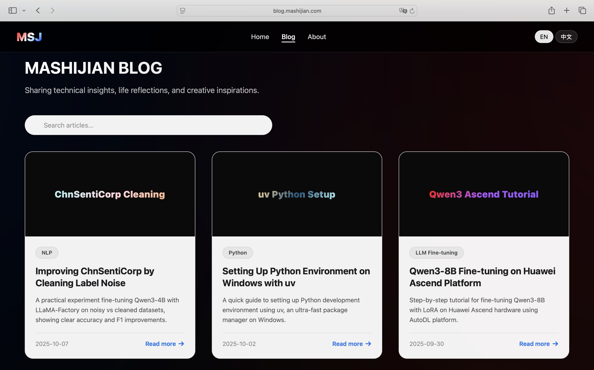

# MSJ Blog - Ma Shijian's Tech Blog

[](https://blog.mashijian.com)
[](https://opensource.org/licenses/MIT)

[中文](README.zh-CN.md) | English

This is the source code for my personal tech blog, a Single-Page Application (SPA) designed to showcase my technical articles, research projects, and innovative practices. The website focuses on cutting-edge fields such as AI Agent development, Natural Language Processing (NLP), Large Language Model (LLM) fine-tuning, and robotics.

The entire website is built using native HTML, CSS, and JavaScript without any frontend frameworks, achieving optimal performance and loading speed. The design pursues simplicity and modernity, with deep optimization for search engine optimization (SEO) and multilingual reading experience.

## 🚀 Live Demo

You can visit the live version at:

**[https://blog.mashijian.com](https://blog.mashijian.com)**

## 📸 Screenshot

[](https://blog.mashijian.com)

## ✨ Key Features

- **Dynamic Article Grid**: Display all articles in a clear, responsive card grid layout.
- **Bilingual Support**: Seamlessly switch between Chinese and English (中文/EN), with instant UI and content response for a friendly reading experience for visitors of different languages.
- **Client-Side Search**: Built-in search box allows instant filtering of articles by title, summary, or category without backend support.
- **Deep SEO Optimization**:
    - Complete `meta` tags including `title`, `description`, and `keywords`.
    - Open Graph (Facebook) and Twitter Card protocols ensure rich preview effects when shared on social media.
    - JSON-LD structured data provides detailed blog, article, and author information to search engines for richer search result displays.
- **Modern & Responsive UI**:
    - Inspired by Apple's design style, featuring dark mode, glass morphism (backdrop-filter), and smooth animations.
    - Fully responsive layout, perfectly adapted for desktop, tablet, and mobile devices.
- **Content Lazy Loading**: "Load More" button displays additional articles on demand, optimizing initial page load performance.
- **Native Tech Stack**: No framework dependencies, ensuring the project is lightweight, fast, and easy to maintain.

## 🔧 Tech Stack

- **HTML5**: Responsible for page structure and semantic content.
- **CSS3**: Used for styling, gradient effects, animations, and responsive layouts implemented with Flexbox and Grid.
- **Vanilla JavaScript (ES6+)**: Implements all interactive logic, including language switching, search functionality, dynamic content loading, and DOM manipulation.

## 🛠️ How to Run Locally

This is a pure static website, very simple to run locally.

1.  **Clone the repository**
    ```bash
    git clone https://github.com/IIIIQIIII/msj-blog.git
    ```

2.  **Navigate to the project directory**
    ```bash
    cd msj-blog
    ```

3.  **Open the page**
    Simply open the `index.html` file in your favorite browser.

    For the best experience (to avoid potential local file protocol issues), it's recommended to use a simple local server to preview the page. If you have VS Code installed, you can use the `Live Server` extension. Or, if you have Python installed, you can run:

    ```bash
    # Python 3
    python -m http.server
    ```
    Then visit `http://localhost:8000` in your browser.

## 📂 File Structure

```
msj-blog/
├── assets/
│   ├── favicon-16.png        # Favicon icon
│   ├── favicon-32.png        # Favicon icon
│   ├── hf-logo.svg           # Hugging Face icon
│   ├── msj-blog-screenshot.png # Website screenshot
│   └── msj-image.png         # Author avatar/share image
├── index.html                # The only HTML file, containing structure, styles, and scripts
├── LICENSE                   # MIT License file
├── README.md                 # This file (English)
└── README.zh-CN.md           # Chinese version of README
```

## 📜 License

This project is licensed under the [MIT License](LICENSE).
