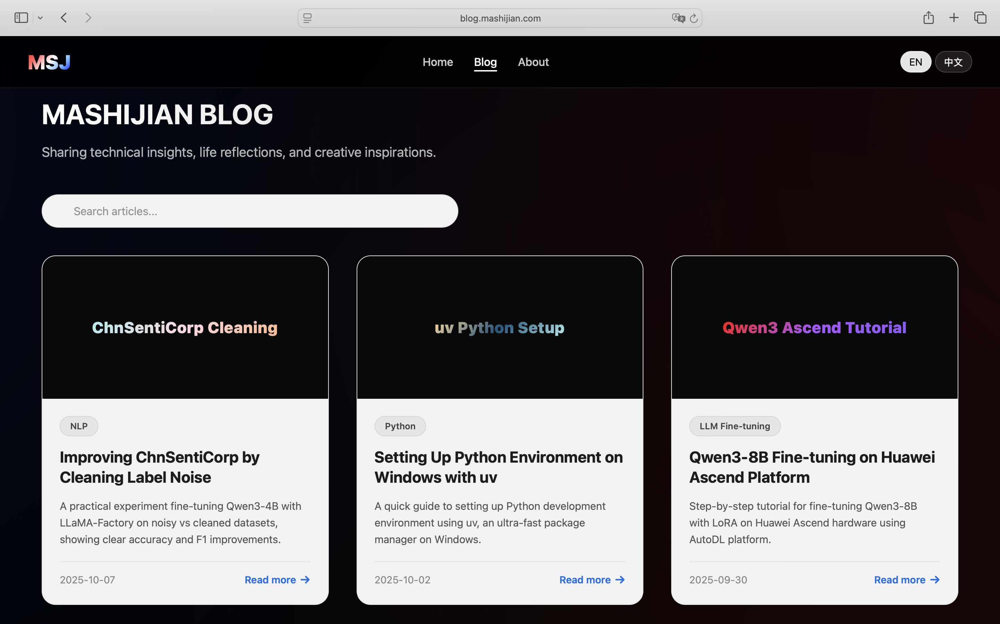

# MSJ Blog - 马诗剑的技术博客

[](https://blog.mashijian.com)
[](https://opensource.org/licenses/MIT)

中文 | [English](README.md)

这是我的个人技术博客的源代码，一个旨在展示我的技术文章、研究项目和创新实践的单页应用（Single-Page Application）。该网站专注于AI Agent开发、自然语言处理（NLP）、大语言模型（LLM）微调、机器人技术等前沿领域。

整个网站使用原生 HTML、CSS 和 JavaScript 构建，没有依赖任何前端框架，以实现极致的性能和加载速度。设计上追求简洁、现代，并为搜索引擎（SEO）和多语言阅读体验进行了深度优化。

## 🚀 实时演示 (Live Demo)

您可以访问以下链接查看在线版本：

**[https://blog.mashijian.com](https://blog.mashijian.com)**

## 📸 网站截图

[](https://blog.mashijian.com)

## ✨ 主要功能

- **动态文章网格**：以清晰、响应式的卡片网格展示所有文章。
- **双语支持**：无缝切换中英文（中文/EN），UI和内容即时响应，为不同语言的访客提供友好的阅读体验。
- **客户端搜索**：通过内置的搜索框，可以即时按标题、摘要或分类筛选文章，无需后端支持。
- **深度SEO优化**：
    - 完整的 `meta` 标签，包括 `title`, `description`, `keywords`。
    - Open Graph (Facebook) 和 Twitter Card 协议，确保在社交媒体上分享时有丰富的预览效果。
    - 使用 JSON-LD 结构化数据，为搜索引擎提供详细的博客、文章和作者信息，以获得更丰富的搜索结果展示。
- **现代与响应式UI**：
    - 灵感源自 Apple 的设计风格，采用深色模式、毛玻璃（backdrop-filter）和流畅的动效。
    - 完全响应式布局，完美适配桌面、平板和移动设备。
- **内容懒加载**：“加载更多”按钮可以按需显示更多文章，优化了首屏加载性能。
- **原生技术栈**：不依赖任何框架，确保项目轻量、快速、易于维护。

## 🔧 技术栈

- **HTML5**: 负责页面的结构和语义化内容。
- **CSS3**: 用于样式设计、渐变效果、动画以及使用 Flexbox 和 Grid 实现的响应式布局。
- **Vanilla JavaScript (ES6+)**: 实现所有交互逻辑，包括语言切换、搜索功能、动态内容加载和 DOM 操作。

## 🛠️ 如何在本地运行

这是一个纯静态网站，在本地运行非常简单。

1.  **克隆仓库**
    ```bash
    git clone https://github.com/IIIIQIIII/msj-blog.git
    ```

2.  **进入项目目录**
    ```bash
    cd msj-blog
    ```

3.  **打开页面**
    直接在您喜欢的浏览器中打开 `index.html` 文件即可。

    为了获得最佳体验（避免潜在的本地文件协议问题），建议使用一个简单的本地服务器来预览页面。如果您安装了 VS Code，可以使用 `Live Server` 插件。或者，如果您安装了 Python，可以运行：

    ```bash
    # Python 3
    python -m http.server
    ```
    然后在浏览器中访问 `http://localhost:8000`。

## 📂 文件结构

```
msj-blog/
├── assets/
│   ├── favicon-16.png        # Favicon 图标
│   ├── favicon-32.png        # Favicon 图标
│   ├── hf-logo.svg           # Hugging Face 图标
│   ├── msj-blog-screenshot.png # 网站截图
│   └── msj-image.png         # 作者头像/分享图
├── index.html                # 唯一的 HTML 文件，包含结构、样式和脚本
└── README.md                 # 你正在阅读的这个文件
```

## 📜 开源协议

该项目采用 [MIT License](https://opensource.org/licenses/MIT) 开源协议。
